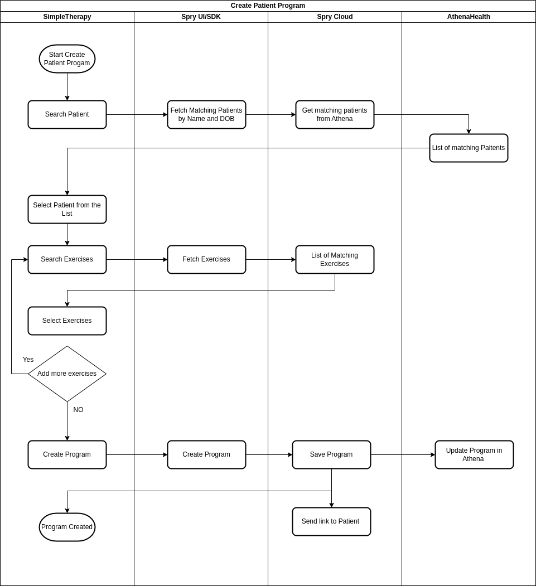

The above flow presents how the therapists will add a custom exercise program to the patient. 

The following steps are involved in creating a customized exercise program 

 1. User (i.e. Therapist) searches for the patient using `Name` and `Date of Birth`
 2. Spry SDK will return a list of matching patients. 
 3. User selects the patient. 
 4. User proceeds to create a customized program for the patient. 
 5. User searches for exercises and adds them to the program.
 6. User selects the `repetition`, `duration`, and `frequency` for each exercise.  
 7. The created program is sent to AthenaHealth using Spry Interoperable Bridge. 
 8. The patient is notified about the program via email/SMS/push notification.  