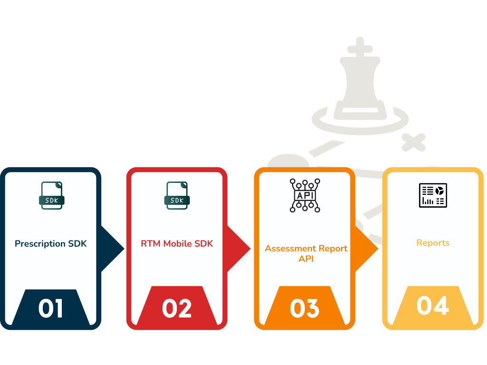

# Getting Started

This documentation describes how to integrate your Spry RTM SDK to build engaging computer vision assessment apps. 

 + Spry Prescription SDK for Javascript
 + Spry Mobile SDKs for RTM
 + SPry RTM APIs for report dashboarding and Adherence tracking

Code and samples for the Spry SDKs will be available on GitHub. When you use the Spry SDKs, follow the Spry RTM Terms of Use and Privacy Policy.

# App Store Connect Requirements

To provide functionality within the Spry iOS SDK, we may receive and process certain contact, location, identifier, and device information associated with assessment users and their use of your application. The information we receive depends on what SDK features third party applications use. 
