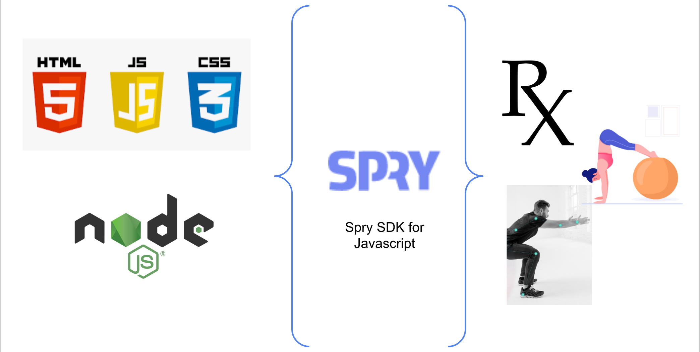

# Introduction

This page is an overview of the Javascript SDK documentation and related resources.

The Assessment Portal SDK for JavaScript enables developers to build libraries and applications that use Spry's Assessment Portal content and services. You can use the JavaScript API in the browser and inside Node.js applications on the server.

The AP SDK for JavaScript API Reference Guide provides a JavaScript API. You can use the JavaScript API to build libraries or applications for Node.js or the browser.