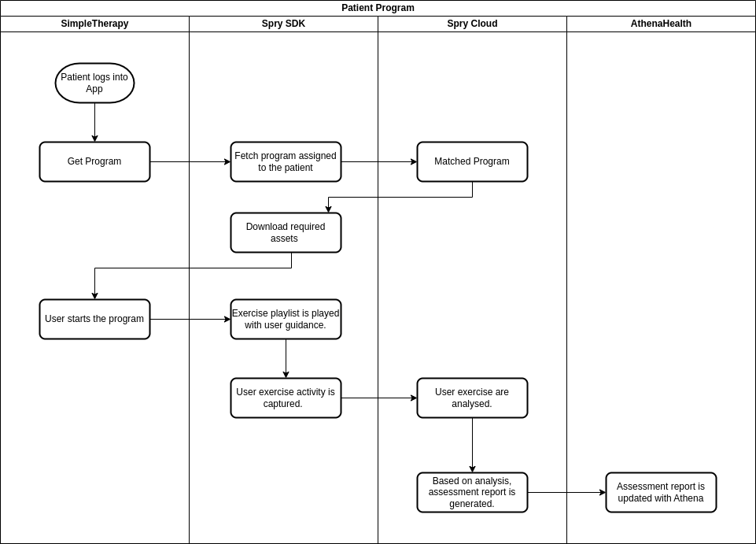

The above flow presents how the patient/user will adhere to the prescribed programs. Once prescribed exercises are done, their assessment is available via API and is also synced with AthenaHealth using Spry Interoperability Bridge.  

The details for assessment reports is available in `API Document`